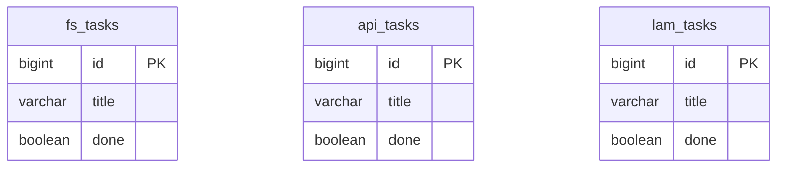

# 05. データ仕様書（Data Specification）

扱うデータの構造・関係・流れを定義する。

## DB 構成方針

- MySQL 8 コンテナ 1 つ、**全アプリで 1 つの DB（`php_practice`）を共有**する。
- 共有による衝突（Laravel の `migrations` / `users` 等）を避けるため、**アプリごとにテーブルプレフィックス**で名前空間を分離する。

| アプリ | prefix | migrations テーブル名 |
|--------|--------|----------------------|
| laravel-fullstack | `fs_` | `fs_migrations` |
| laravel-api | `api_` | `api_migrations` |
| laminas | `lam_` | （マイグレーションツール未使用 / SQL 直） |

Laravel は `config/database.php` の接続設定で `prefix` と `migrations` テーブル名を指定する。

## データモデル（サンプル）

学習用サンプルとして、各アプリ共通で「タスク（Task）」の CRUD を実装する。

| 属性 | 型 | 説明 |
|------|----|------|
| id | BIGINT (PK, AI) | 識別子 |
| user_id | BIGINT (FK) | 所有ユーザー（認証導入で追加） |
| title | VARCHAR(255) | タスク名（必須） |
| done | TINYINT(1) | 完了フラグ（既定 0） |
| start_date | DATE NULL | 開始日（任意） |
| end_date | DATE NULL | 終了日（任意・開始日以降） |
| image_path | VARCHAR NULL | 添付画像の保存パス（任意・名前付きボリューム内） |
| url | VARCHAR NULL | 登録 URL（任意・fullstack）|
| preview_title | VARCHAR NULL | サーバー取得した og:title / title（キャッシュ）|
| preview_image | VARCHAR NULL | サーバー取得した og:image の URL（キャッシュ）|
| created_at | TIMESTAMP | 作成日時 |
| updated_at | TIMESTAMP | 更新日時 |

## ER 図

3 アプリは同一 DB 内に prefix 違いの独立テーブルを持つ（実体は分離、相互参照は学習で任意に追加）。

## データフロー

リクエスト → 各 PHP アプリ（Controller → Model/Repository）→ MySQL `php_practice`（prefix 付きテーブル）→ レスポンス。
