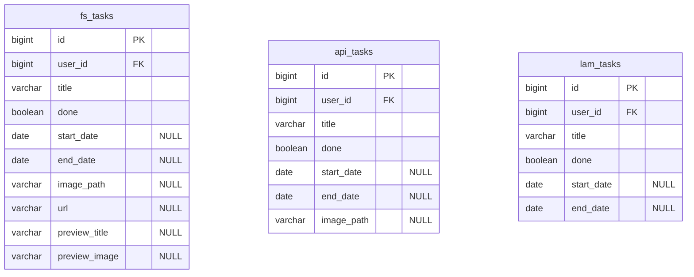

# 05. データ仕様書（Data Specification）

扱うデータの構造・関係・流れを定義する。

## DB 構成方針

- MySQL 8 コンテナ 1 つ、**全アプリで 1 つの DB（`php_practice`）を共有**する。
- 共有による衝突（Laravel の `migrations` / `users` 等）を避けるため、**アプリごとにテーブルプレフィックス**で名前空間を分離する。

| アプリ | prefix | migrations テーブル名 |
| -------- | -------- | ---------------------- |
| laravel-fullstack | `fs_` | `fs_migrations` |
| laravel-api | `api_` | `api_migrations` |
| laminas | `lam_` | （マイグレーションツール未使用 / SQL 直） |

Laravel は `config/database.php` の接続設定で `prefix` と `migrations` テーブル名を指定する。

## データモデル（サンプル）

学習用サンプルとして、各アプリ共通で「タスク（Task）」の CRUD を実装する。

| 属性 | 型 | 説明 |
| ------ | ---- | ------ |
| id | BIGINT (PK, AI) | 識別子 |
| user_id | BIGINT (FK) | 所有ユーザー（認証導入で追加） |
| title | VARCHAR(255) | タスク名（必須） |
| done | TINYINT(1) | 完了フラグ（既定 0） |
| start_date | DATE NULL | 開始日（任意） |
| end_date | DATE NULL | 終了日（任意・開始日以降） |
| image_path | VARCHAR NULL | 添付画像の保存パス（任意・名前付きボリューム内） |
| url | VARCHAR NULL | 登録 URL（任意・fullstack） |
| preview_title | VARCHAR NULL | サーバー取得した og:title / title（キャッシュ） |
| preview_image | VARCHAR NULL | サーバー取得した og:image の URL（キャッシュ） |
| created_at | TIMESTAMP | 作成日時（監査列） |
| updated_at | TIMESTAMP | 更新日時（監査列） |

### 監査列の設定責務

`created_at` / `updated_at` は業務コードで代入せず、アプリごとに**単一の層**で設定する（ルールは `.claude/rules/php.md` の「監査列」）。作成者・更新者（`created_by` / `updated_by`）は本アプリの要件外とし、保持しない。

| アプリ | 設定する層 |
| --- | --- |
| laravel-fullstack / laravel-api | Eloquent の自動タイムスタンプ（マイグレーションの `$table->timestamps()`）。`$fillable` には含めない |
| laminas | `TaskTable::saveTask()` / `UserTable::create()`（TableGateway には自動機構がないため Table 層に集約）。タスクは insert で両列・update で `updated_at` のみ、ユーザーは insert で `created_at` を設定する |

laminas は DB 側の `DEFAULT CURRENT_TIMESTAMP` / `ON UPDATE CURRENT_TIMESTAMP` を採らない。値の生成元が MySQL サーバの時計になり、**アプリの時計で書く Laravel 2 アプリと値の作られ方が非対称**になるため（3 アプリとも PHP の既定タイムゾーンは UTC）。書式は MySQL の `TIMESTAMP` と、テストで使う SQLite の `TEXT` の双方が解釈できる `'Y-m-d H:i:s'` に固定する。

> 監査列を「保存後に別の UPDATE で進める」実装にしてはならない。`saveTask()` の update は `id` + `user_id` で所有者スコープを掛けており、監査列だけを別クエリに分けると**その条件が抜けて他人のタスクの `updated_at` を動かせる**。認可と監査列は同じ 1 本の UPDATE に載せる。

この対応より前に作成された `lam_tasks` / `lam_users` の既存行は、監査列が NULL のまま残る。共有 MySQL への一括 UPDATE によるバックフィルは行わない（`.claude/rules/production-data.md`）。

### ユーザーテーブルの監査列（3 アプリ差分）

| アプリ | テーブル | `created_at` | `updated_at` |
| --- | --- | --- | --- |
| laravel-fullstack / laravel-api | `fs_users` / `api_users` | あり | あり（`$table->timestamps()` が両方作る） |
| laminas | `lam_users` | あり | **持たない** |

laminas のユーザーは登録後に更新される契機が無い（プロフィール編集・パスワード変更の機能を持たない）ため、`updated_at` 列を作らない。使われない列を「将来のため」に持たない方針による（`.claude/rules/dead-code.md`）。Laravel 側に列があるのは、`$table->timestamps()` が両方をまとめて作る規約のため（意図的に片方だけ落とすとフレームワークの既定から外れる）。

将来 laminas にユーザー情報の更新機能を追加する場合は、`lam_users` へ `updated_at` を足したうえで、**`UserTable` の更新メソッドに設定を集約する**（`TaskTable::saveTask()` と同じ形）。既存ローカル DB への `ALTER TABLE` 手順が必要になる点に注意する（`docker/mysql/init/` は初回起動時にしか実行されない）。

## ER 図

3 アプリは同一 DB 内に prefix 違いの独立テーブルを持つ（実体は分離、相互参照は学習で任意に追加）。

## データフロー

リクエスト → 各 PHP アプリ（Controller → Model/Repository）→ MySQL `php_practice`（prefix 付きテーブル）→ レスポンス。

### 画像ファイルと DB の整合性（fullstack / api）

`image_path` は MySQL に、実体は名前付きボリューム（`task-uploads`）にあり、**保存先が 2 つに分かれる**。ファイルシステムは DB トランザクションに参加できず、削除したファイルはロールバックで戻らないため、順序と補償で整合を取る。

**不変条件**: DB に保存された `image_path` は必ず実在する。

守れない状態が 2 つあり、片方だけを許容する。

| 状態 | 影響 | 復旧 | 扱い |
| --- | --- | --- | --- |
| 参照切れ（DB に path・ファイル無し） | 画像が 404 になる | 不能 | **禁止** |
| 孤児ファイル（ファイル有り・DB から未参照） | ディスクを消費する | 後から掃除できる | 許容 |

したがって**ファイルは早く作り、遅く消す**。

| 操作 | 順序 | 失敗時 |
| --- | --- | --- |
| 作成・複製 | ファイル作成 → DB | DB 失敗ならファイルを補償削除。ファイル失敗なら DB へ進まない |
| 更新（画像差し替え） | 新ファイル作成 → DB → **旧ファイル削除** | DB 失敗なら新ファイルを補償削除（旧画像は無傷） |
| 削除 | **DB 削除 → ファイル削除** | DB 失敗ならファイルは残す（再試行で復旧できる） |

更新で旧画像を先に削除してはならない。保存・DB 更新のどちらが失敗しても旧画像を復旧できなくなる。削除で逆順にすると、DB 削除が失敗したときに画像だけが失われ、再試行しても戻らない。

Eloquent の `update()` / `delete()` はモデルイベントで中断されると例外を投げずに `false` を返すため、これも失敗として扱う（見逃すと参照切れになる）。一方、作成の中断は「ファイルが残り DB 行が無い」＝孤児ファイルなので不変条件は破れない。

laminas は画像添付に対応しないため対象外（`docs/03`）。検証は両 Laravel アプリの `TaskImageIntegrityTest`（失敗注入）で行う（`docs/08`）。
